# CSGO-Market

CSGO-Market 是一个专注于 CSGO 游戏物品市场数据分析的全栈应用。通过爬取 Steam 市场数据，对物品价格趋势进行实时监控、分析和可视化展示，为玩家和投资者提供数据支持，帮助用户做出更明智的交易决策。

## 目录

- [项目概述](#项目概述)
- [系统架构](#系统架构)
- [技术栈](#技术栈)
- [功能模块](#功能模块)
- [数据模型](#数据模型)
- [API 设计](#API设计)
- [前端实现](#前端实现)
- [后端实现](#后端实现)
- [页面展示](#页面展示)
- [部署方案](#部署方案)
- [性能优化](#性能优化)
- [安全措施](#安全措施)
- [扩展计划](#扩展计划)

## 项目概述

### 项目背景

CSGO 物品交易市场拥有庞大的用户群体和活跃的经济系统，物品价格波动频繁。用户需要准确的数据分析工具来跟踪市场变化，识别投资机会，降低风险。

### 项目目标

- 提供实时的物品价格监控
- 对历史价格数据进行分析，展示价格趋势
- 识别价格异常波动和潜在投资机会
- 通过数据可视化提供直观的市场概览
- 支持用户自定义的物品监控和分析

## 系统架构

CSGO-Market 采用前后端分离的微服务架构设计，保证系统的可扩展性和维护性。

### 架构图

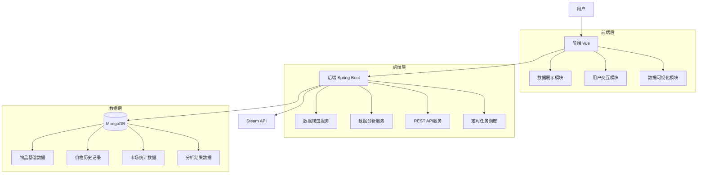

### 数据流程

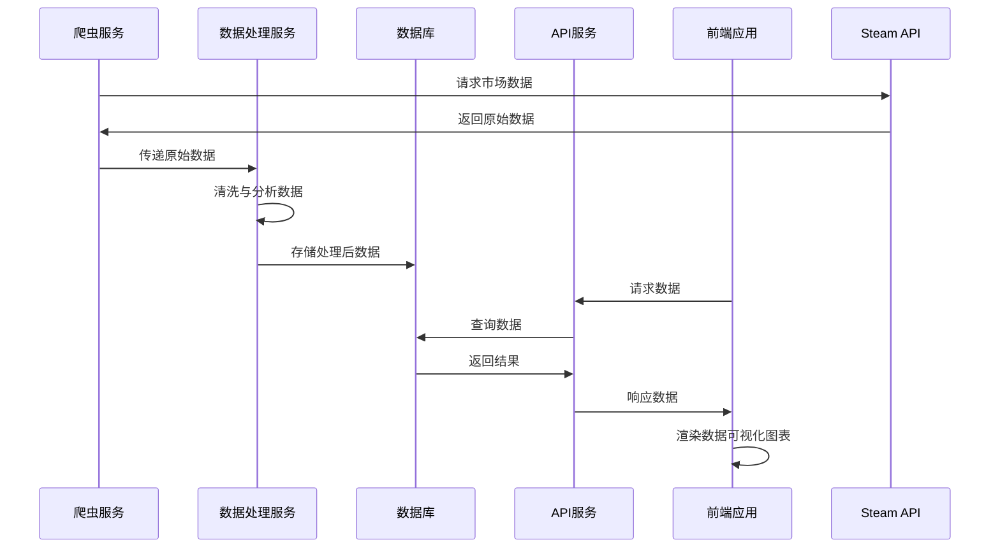

## 技术栈

### 后端技术栈

- **基础框架**: Spring Boot 3.x
- **数据存储**: MongoDB 5.x
- **数据访问**: Spring Data MongoDB
- **API 设计**: RESTful API
- **任务调度**: Spring Scheduler
- **构建工具**: Maven 3.8+
- **运行环境**: JDK 17+

### 前端技术栈

- **框架**: Vue 3.x
- **构建工具**: Vite 6.x
- **类型支持**: TypeScript 5.x
- **UI 组件库**: Element Plus 2.x
- **数据可视化**: ECharts 5.x
- **状态管理**: Pinia 3.x
- **路由管理**: Vue Router 4.x
- **HTTP 客户端**: Axios
- **WebSocket 支持**: SockJS, StompJS

## 功能模块

### 核心功能模块

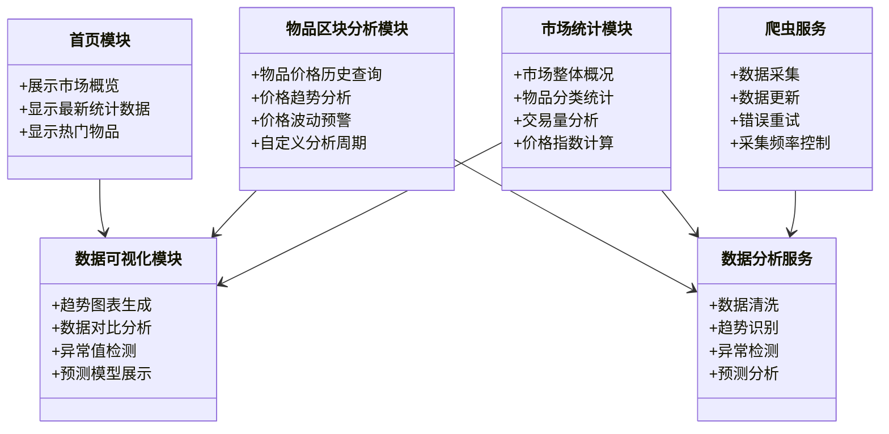

### 功能流程

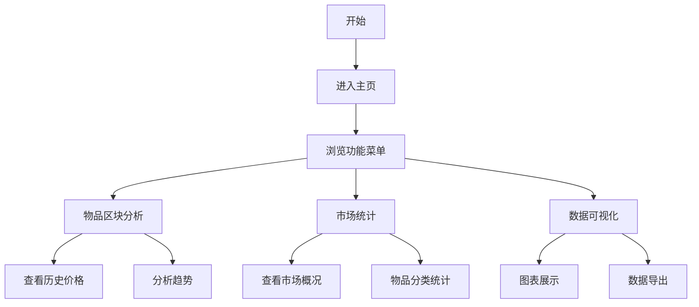

## 数据模型

系统采用 MongoDB 进行数据存储，主要包含以下集合：

### 物品基础信息 (ItemBlock)

```json
{
  "id": "ObjectId",
  "name": "String", // 物品名称
  "category": "ItemBlockCategory", // 物品分类
  "price": "Double", // 当前价格
  "volume": "Integer", // 交易量
  "items": ["ItemBlockItem"], // 关联物品
  "data": ["ItemBlockData"], // 历史数据
  "updateTime": "Date" // 更新时间
}
```

### 物品历史数据 (ItemBlockData)

```json
{
  "id": "ObjectId",
  "price": "Double", // 历史价格
  "volume": "Integer", // 历史交易量
  "timestamp": "Date" // 记录时间
}
```

### 市场统计数据 (Statistics)

```json
{
  "id": "ObjectId",
  "totalItems": "Integer", // 物品总数
  "totalVolume": "Integer", // 总交易量
  "avgPrice": "Double", // 平均价格
  "priceIndex": "Double", // 价格指数
  "todayStatistics": "TodayStatistics", // 今日统计
  "yesterdayStatistics": "YesterdayStatistics", // 昨日统计
  "updateTime": "Date" // 更新时间
}
```

## API 设计

系统 API 采用 RESTful 风格设计，主要包含以下端点：

### 首页 API

- `GET /api/home` - 获取首页数据
- `GET /api/itemblocks` - 获取最近物品区块数据
- `GET /api/statistics` - 获取最新统计数据

### 物品区块 API

- `GET /api/itemblock/{id}` - 获取指定物品区块详情
- `GET /api/itemblock/category/{category}` - 获取指定分类的物品区块
- `GET /api/itemblock/search?name={name}` - 搜索物品区块
- `POST /api/itemblock/analyze` - 执行自定义分析

### 统计分析 API

- `GET /api/statistics/daily` - 获取每日统计数据
- `GET /api/statistics/weekly` - 获取每周统计数据
- `GET /api/statistics/monthly` - 获取每月统计数据
- `GET /api/statistics/trend` - 获取趋势分析数据

## 前端实现

### 目录结构

```
vue/
├── public/              # 静态资源
├── src/
│   ├── api/             # API请求模块
│   ├── assets/          # 项目资源文件
│   ├── components/      # 公共组件
│   ├── router/          # 路由配置
│   ├── stores/          # 状态管理
│   ├── utils/           # 工具函数
│   ├── views/           # 页面视图
│   │   ├── csgo/        # CSGO相关页面
│   │   └── HomeView.vue # 首页视图
│   ├── App.vue          # 根组件
│   └── main.ts          # 入口文件
├── package.json         # 项目依赖
└── vite.config.ts       # Vite配置
```

### 关键实现

1. **数据可视化**：使用 ECharts 实现各类图表展示，包括价格趋势图、交易量变化图、分类统计图等
2. **响应式设计**：使用 Vue3 Composition API 和 Pinia 实现响应式数据管理
3. **动态组件**：实现数据分析组件的动态加载和渲染
4. **实时更新**：通过 WebSocket 实现数据的实时推送和更新

## 后端实现

### 目录结构

```
Spring/
├── src/
│   ├── main/
│   │   ├── java/
│   │   │   └── com/
│   │   │       └── gzy/
│   │   │           ├── config/       # 配置类
│   │   │           ├── controller/   # 控制器
│   │   │           ├── entity/       # 实体类
│   │   │           ├── repository/   # 数据访问层
│   │   │           ├── service/      # 业务逻辑层
│   │   │           ├── crawler/      # 爬虫服务
│   │   │           └── SpringCsApplication.java # 应用入口
│   │   └── resources/
│   │       └── application.yml       # 应用配置
│   └── test/                         # 测试代码
└── pom.xml                           # 项目依赖
```

### 关键实现

1. **数据爬虫**：实现对 Steam 市场数据的定时爬取和更新
2. **数据分析**：对爬取的数据进行清洗、分析和处理51
3. **REST API**：提供 RESTful 风格的 API 接口
4. **定时任务**：使用 Spring Scheduler 实现定时数据更新
5. **数据持久化**：使用 Spring Data MongoDB 实现数据持久化

## 页面展示

- 首页
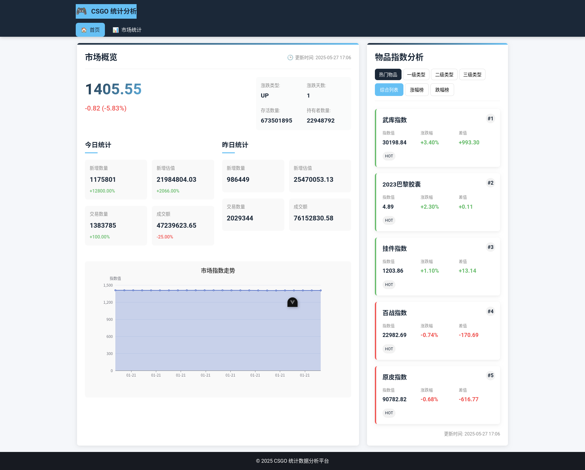

- 市场统计
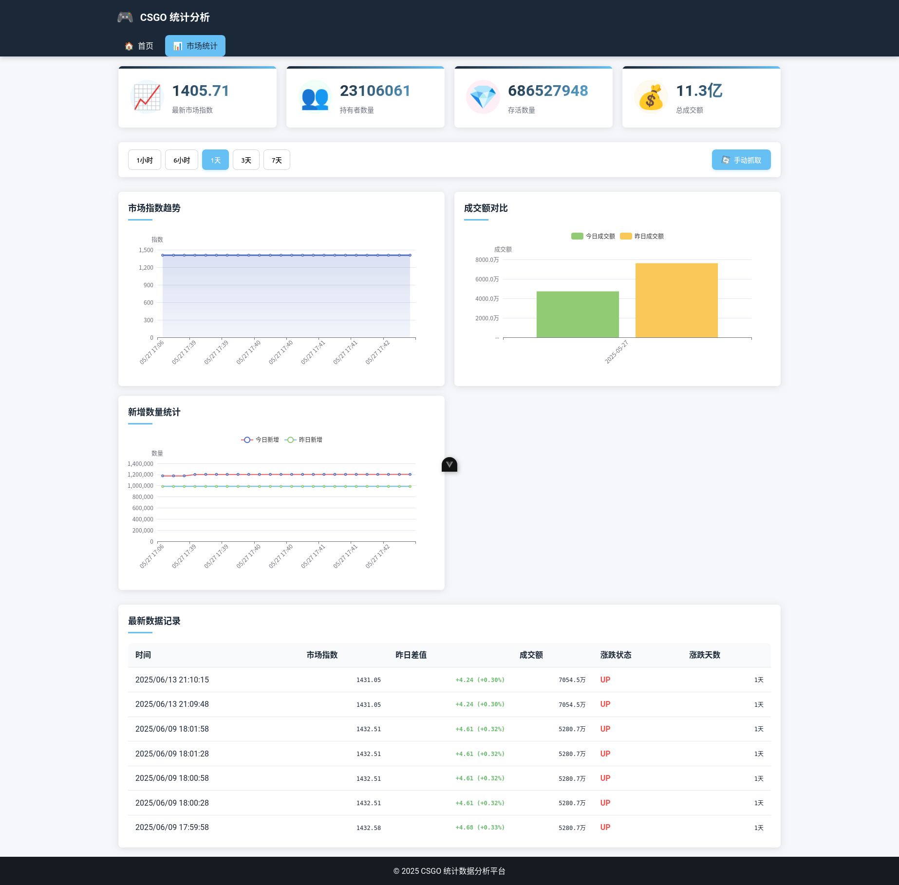


## 部署方案

### 开发环境

- JDK 17+
- Node.js 18+
- MongoDB 5+
- Maven 3.8+

### 测试环境部署

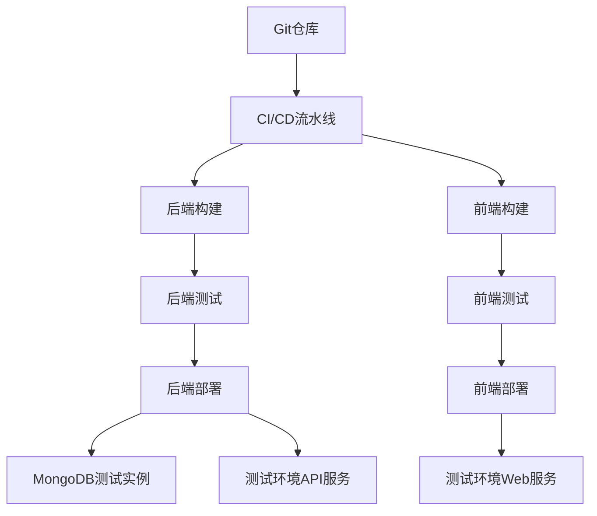

### 生产环境部署

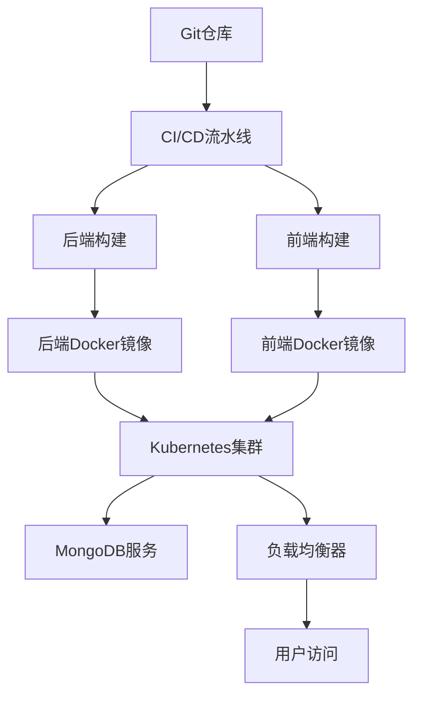

### 部署步骤

#### 后端部署

```bash
# 编译打包
cd Spring
mvn clean package -DskipTests

# 运行
java -jar target/csgo-market-1.0.0.jar
```

#### 前端部署

```bash
# 安装依赖
cd vue
npm install
# 或
yarn install

# 构建生产版本
npm run build
# 或
yarn build

# 部署静态文件
cp -r dist/* /var/www/html/
```

## 性能优化

### 数据库优化

1. **索引优化**：为常用查询字段创建索引
2. **数据分片**：根据时间和分类对数据进行分片
3. **缓存策略**：实现多级缓存，减少数据库访问

### 前端优化

1. **代码分割**：使用动态导入实现路由级别的代码分割
2. **懒加载**：实现图片和组件的懒加载
3. **资源优化**：压缩静态资源，使用 CDN 加速

## 安全措施

1. **认证授权**：实现 JWT 认证和基于角色的访问控制
2. **数据验证**：对所有用户输入进行严格验证
3. **HTTPS**：使用 HTTPS 保护数据传输安全
4. **CORS**：配置适当的 CORS 策略
5. **日志记录**：记录关键操作日志，便于审计

## 扩展计划

### 短期计划

- [ ] 增加更多数据可视化图表类型
- [ ] 优化移动端适配
- [ ] 添加用户反馈功能

### 长期计划

- [ ] 实现机器学习价格预测
- [ ] 开发移动应用
- [ ] 支持更多游戏物品市场分析

## 项目结构

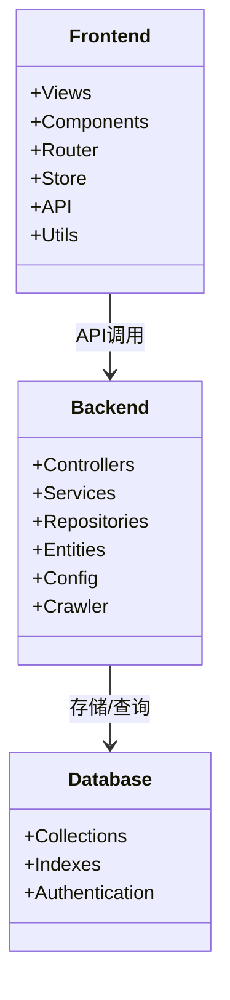

## 安装指南

### 前提条件

- JDK 17+
- Node.js 18+
- MongoDB 5+
- Maven 3.8+

### 后端部署

```bash
# 克隆项目
git clone https://github.com/yourusername/steamdt.git
cd steamdt/Spring

# 编译打包
mvn clean package -DskipTests

# 运行
java -jar target/csgo-market-1.0.0.jar
```

### 前端部署

```bash
# 进入前端目录
cd ../vue

# 安装依赖
npm install
# 或
yarn install

# 开发模式运行
npm run dev
# 或
yarn dev

# 构建生产版本
npm run build
# 或
yarn build
```

## 功能流程示例

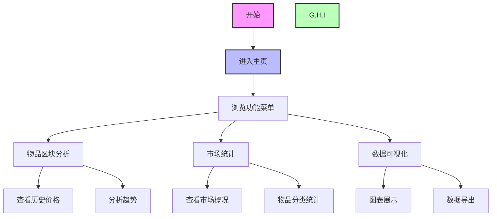

## 使用说明

1. 启动后端服务和前端应用
2. 访问 `http://localhost:5173`（开发模式）或部署后的 URL
3. 在首页可查看最新的市场数据和统计信息
4. 使用分析工具探索物品价格趋势和市场变化

## 配置说明

### 后端配置

修改 `Spring/src/main/resources/application.yml` 文件:

```yaml
spring:
  data:
    mongodb:
      host: 你的MongoDB主机
      port: 27017
      database: csgo
      username: 你的用户名
      password: 你的密码
      authentication-database: admin

server:
  port: 8080
```

### 前端配置

如需修改 API 地址，编辑 `vue/src/api/config.ts` 文件。

## 开发路线图

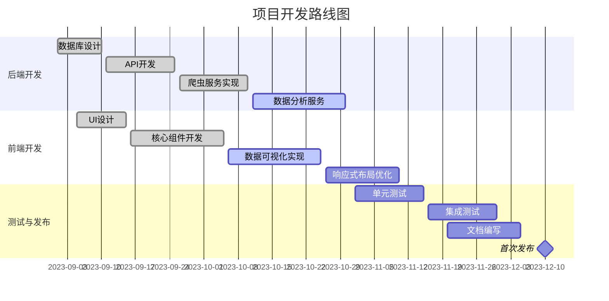

## 贡献指南

欢迎贡献代码、报告问题或提出新功能建议！

1. Fork 本仓库
2. 创建你的特性分支 (`git checkout -b feature/amazing-feature`)
3. 提交你的更改 (`git commit -m 'Add some amazing feature'`)
4. 推送到分支 (`git push origin feature/amazing-feature`)
5. 创建一个 Pull Request

## 许可证

[MIT License](LICENSE)

---

> CSGO 市场数据分析，让交易更明智，投资更精准。

<!-- TODO: 后续添加更多使用场景和最佳实践示例 -->
