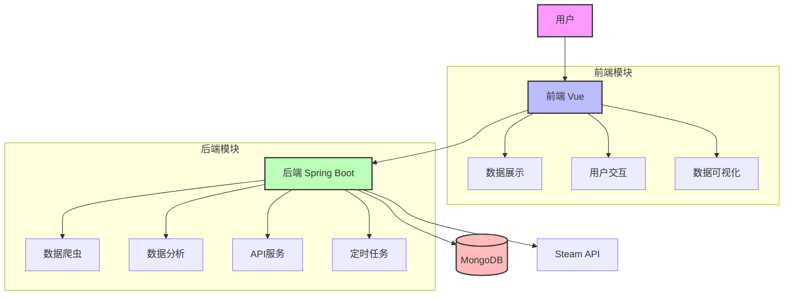
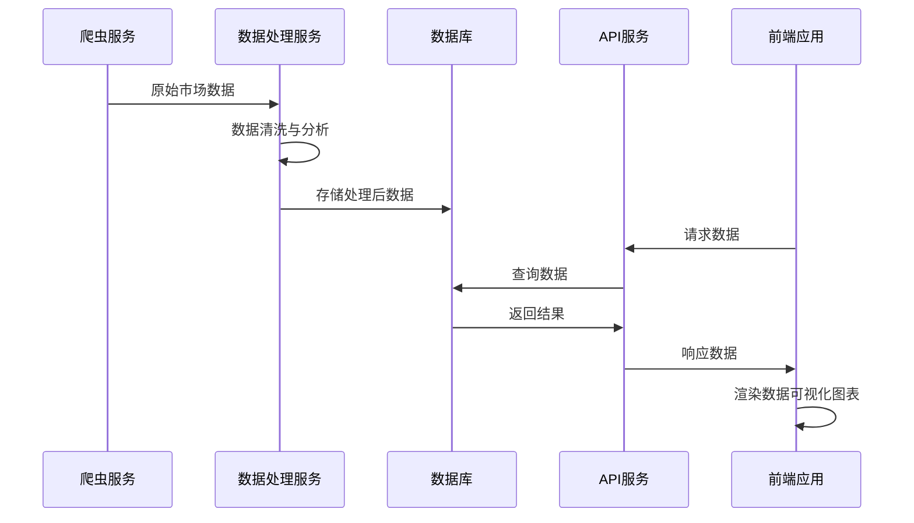
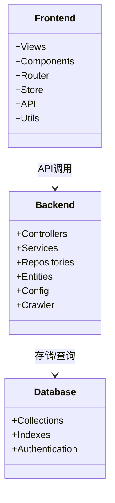
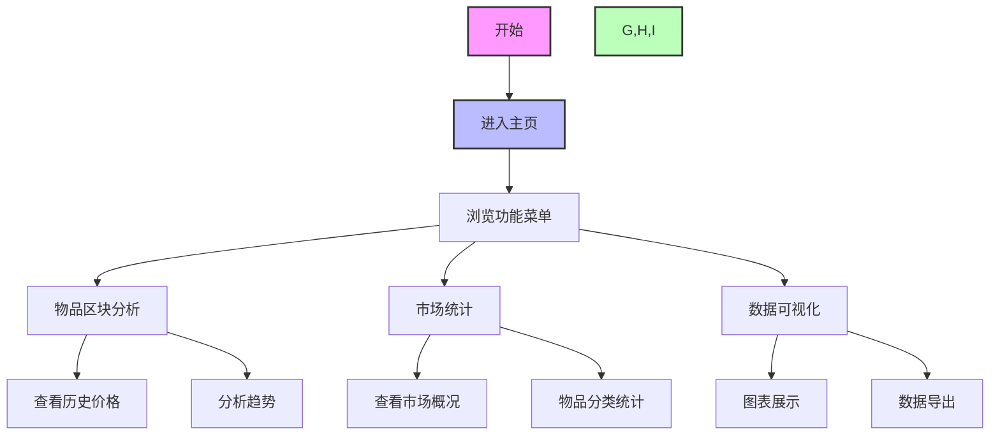
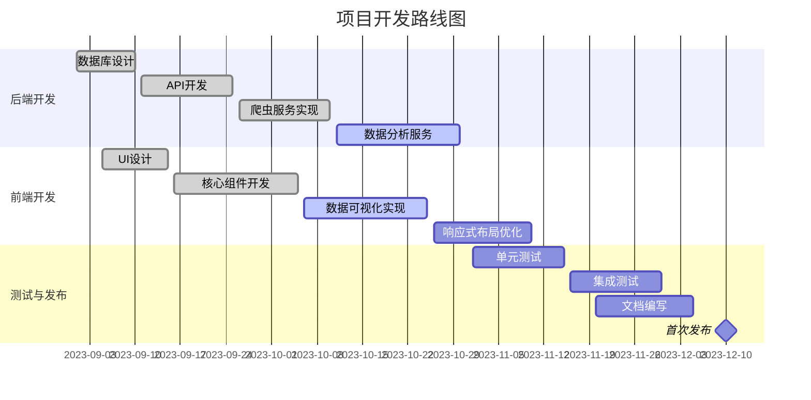

# CSGO-Market

CSGO-Market是一个用于收集、分析和展示CSGO物品市场数据的全栈应用。该项目提供了物品价格趋势分析、市场统计数据和物品区块分析等功能。

## 项目介绍

本项目通过爬取CSGO市场数据，对物品价格和交易情况进行分析，帮助用户更好地了解市场趋势，为投资和交易决策提供数据支持。

<details open>
<summary>主要功能</summary>

| 功能 | 描述 |
|------|------|
| 物品区块分析 | 分析物品价格区块变动趋势 |
| 市场统计 | 提供市场整体统计数据 |
| 数据可视化 | 使用图表直观展示数据变化 |
| 实时数据更新 | 定时任务自动更新最新市场数据 |

</details>

## 项目架构



## 数据流程



## 技术栈

### 后端
- Spring Boot
- MongoDB
- Spring Data
- RESTful API
- 定时任务调度

### 前端
- Vue 3
- TypeScript
- Element Plus
- ECharts
- Axios
- Pinia
- Vue Router

## 项目结构



## 安装指南

### 前提条件
- JDK 17+
- Node.js 18+
- MongoDB 5+
- Maven 3.8+

### 后端部署
```bash
# 克隆项目
git clone https://github.com/yourusername/steamdt.git
cd steamdt/Spring

# 编译打包
mvn clean package -DskipTests

# 运行
java -jar target/csgo-market-1.0.0.jar
```

### 前端部署
```bash
# 进入前端目录
cd ../vue

# 安装依赖
npm install
# 或
yarn install

# 开发模式运行
npm run dev
# 或
yarn dev

# 构建生产版本
npm run build
# 或
yarn build
```

## 功能流程示例



## 使用说明

1. 启动后端服务和前端应用
2. 访问 `http://localhost:5173`（开发模式）或部署后的URL
3. 在首页可查看最新的市场数据和统计信息
4. 使用分析工具探索物品价格趋势和市场变化

## 配置说明

### 后端配置
修改 `Spring/src/main/resources/application.yml` 文件:

```yaml
spring:
  data:
    mongodb:
      host: 你的MongoDB主机
      port: 27017
      database: csgo
      username: 你的用户名
      password: 你的密码
      authentication-database: admin

server:
  port: 8080
```

### 前端配置
如需修改API地址，编辑 `vue/src/api/config.ts` 文件。

## 开发路线图



## 贡献指南
欢迎贡献代码、报告问题或提出新功能建议！

1. Fork 本仓库
2. 创建你的特性分支 (`git checkout -b feature/amazing-feature`)
3. 提交你的更改 (`git commit -m 'Add some amazing feature'`)
4. 推送到分支 (`git push origin feature/amazing-feature`)
5. 创建一个 Pull Request

## 许可证
[MIT License](LICENSE)

---

> CSGO市场数据分析，让交易更明智，投资更精准。

<!-- TODO: 后续添加更多使用场景和最佳实践示例 -->
